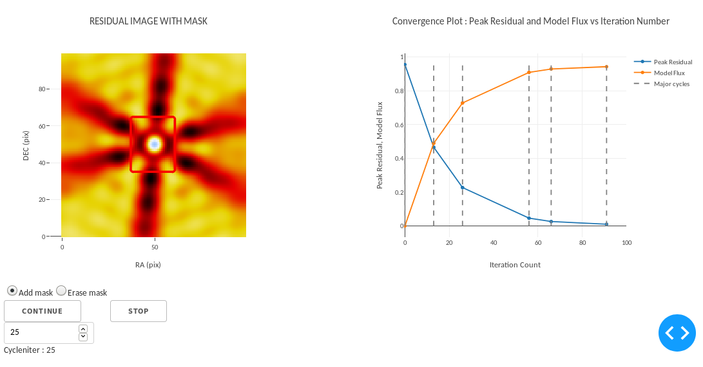

# Interactive Imaging with CASA6

Experiments using dash/plotly with casa6 to implement interactive mask drawing 

To run, install dash in a python3 environment, start as "python Example_Interactive_Imager_App.py", and point a browser to http://127.0.0.1:8050

(1) Example_no_Casa6 : An example of a dash application that allows interactive mask drawing and iteration control. This uses a fake image reconstruction class that operates with noise and a few bright spots.

(2) Casa6_PySynthesisImager :  An example using the casa6 PySynthesisImager class.  Mask drawing is enabled but summary plots are more coarse-grained than above and iteration control is limited.

(3) Casa6_synthesis_tools : An example using the synthesisXXXX tools. This includes mask drawing as well as iteration control similar to the example in (1). 

DATA : Within NRAO, copy over :  /home/casa/data/trunk/regression/unittest/clean/refimager/refim_point.ms     as   point.ms in your local directory. 

An example Screenshot from the Casa6_synthesis_tools version is shown below. A single point source (the above MS) is imaged with user-controlled values of 'cycleniter' before each major cycle and an interactively-drawn mask. 

Note : After running the app, if the server is stopped from the command line but the browser window is still open, you may run into this known dash bug : https://github.com/plotly/dash/issues/920    . The solution for now is to close the browser tab. 